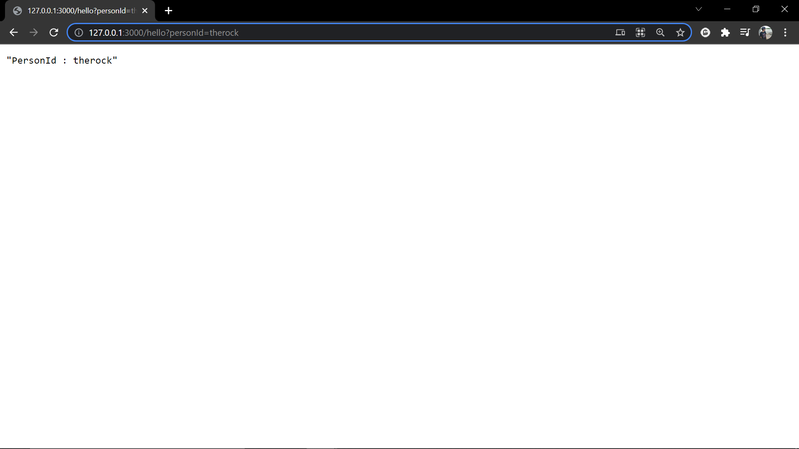

### I saw few comments in the [video](https://www.youtube.com/watch?v=AUQRyl1SNcU&t=103s) saying to do the same in python. So here we go.
### Please follow along wiht the video for better understanding

